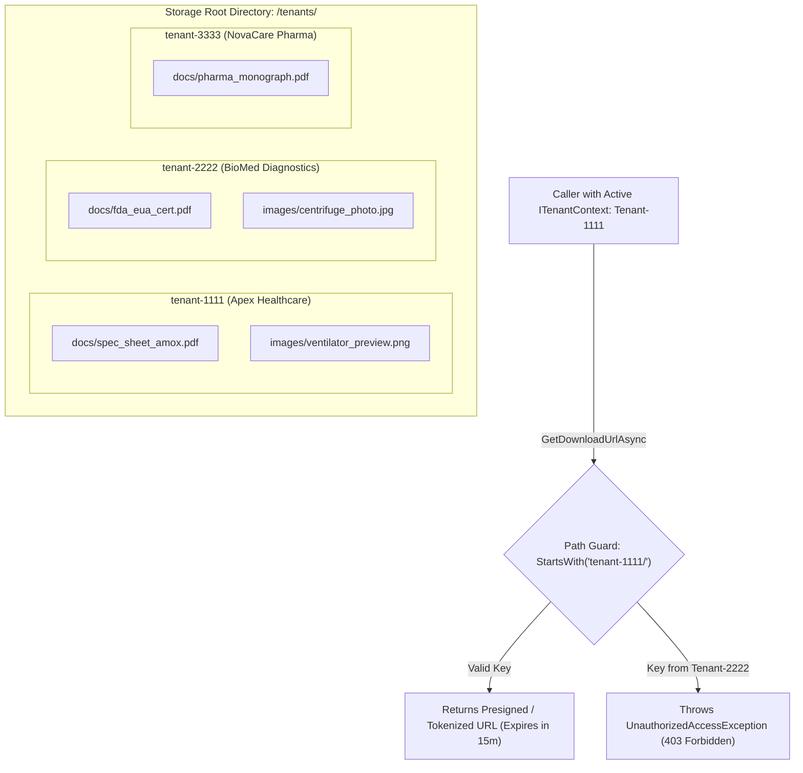
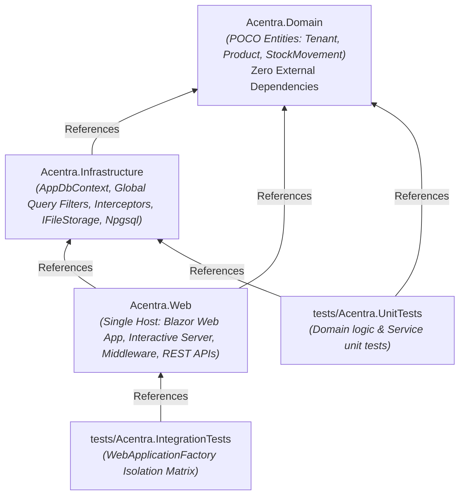

# Architecture Diagrams — Multi-Tenant Inventory Platform 🛡️
*Companion Visual Guide for [problem-statement.md](https://github.com/Panther-Mughil/Acentra/blob/main/docs/problem-statement.md)*

---

## 1. 🌐 System Context & High-Level Architecture

```mermaid
graph TD
    subgraph ClientLayer ["Client / Browser Layer"]
        Browser["User Browser / Admin Client"]
        Switcher["Tenant Switcher (UI Component)"]
    end

    subgraph HostLayer ["Acentra.Web Host (ASP.NET Core / Blazor Server)"]
        HTTP["HTTP / SignalR Connection"]
        Auth["Authentication & JWT Claims"]
        MW["TenantResolutionMiddleware (Hint: X-Tenant / Subdomain / Claims)"]
        CircuitScope["Circuit-Scoped TenantState / ITenantContext"]
        BlazorComp["Interactive Razor Components (Inventory, Files, Dashboard)"]
        REST["REST Endpoints (/api/inventory, /api/storage)"]
        DbContextFactory["IDbContextFactory<AppDbContext>"]
    end

    subgraph DataLayer ["Acentra.Infrastructure & Data Access"]
        EF["EF Core AppDbContext"]
        QueryFilter["Global Query Filter: WHERE TenantId = @CurrentTenantId"]
        WriteInterceptor["SaveChanges Interceptor (Auto-Stamp TenantId & Block IDOR)"]
        Postgres[(PostgreSQL 17.11 DB - Shared Schema)]
    end

    subgraph StorageLayer ["Storage Subsystem"]
        IFileStorage["IFileStorage Abstraction"]
        LocalStorage["Local Filesystem (<root>/tenants/{tenantId}/*)"]
        MinioS3["AWS S3 / MinIO (S3-Compatible Bucket)"]
    end

    Browser -->|1. Initial HTTP / SignalR (X-Tenant: acme)| HTTP
    Switcher -->|Mutates Tenant Context| CircuitScope
    HTTP --> Auth
    Auth --> MW
    MW -->|Resolves Slug & Validates Principal| CircuitScope
    CircuitScope --> BlazorComp
    CircuitScope --> REST
    BlazorComp --> DbContextFactory
    REST --> DbContextFactory
    DbContextFactory --> EF
    EF --> QueryFilter
    EF --> WriteInterceptor
    QueryFilter --> Postgres
    WriteInterceptor --> Postgres
    BlazorComp --> IFileStorage
    REST --> IFileStorage
    IFileStorage --> LocalStorage
    IFileStorage --> MinioS3
```

---

## 2. ⚡ Blazor Server Circuit & Tenant Resolution Flow (§4.1)

```mermaid
sequenceDiagram
    autonumber
    actor User as User / Admin
    participant Browser as Blazor Client (UI)
    participant SignalR as SignalR Circuit Negotiate
    participant MW as TenantResolutionMiddleware
    participant TS as Circuit-Scoped TenantState
    participant Factory as IDbContextFactory
    participant EF as AppDbContext
    participant DB as PostgreSQL DB

    User->>Browser: Opens app with header `X-Tenant: acme`
    Browser->>SignalR: Initial HTTP Handshake & Negotiate
    SignalR->>MW: Executes Middleware Pipeline
    MW->>MW: Resolves Slug "acme" to Tenant ID
    MW->>TS: Initializes circuit TenantState { TenantId, Slug: "acme" }
    
    rect rgb(20, 35, 60)
        Note over Browser,DB: Normal In-Circuit Query
        Browser->>Factory: Requests Inventory Data
        Factory->>EF: Creates short-lived AppDbContext
        EF->>EF: Injects ITenantContext from TenantState
        EF->>DB: Executes SQL WHERE TenantId = @TenantId
        DB-->>Browser: Returns ONLY "acme" products
    end

    rect rgb(45, 25, 60)
        Note over User,DB: Tenant Switch Event (In-Circuit)
        User->>Browser: Selects "XYZ Industries" in Switcher
        Browser->>TS: Mutates TenantState.SetTenant("xyz-industries")
        Browser->>Browser: Drops cached UI state
        Browser->>Factory: Triggers reload
        Factory->>EF: Spawns fresh AppDbContext with new TenantId
        EF->>DB: Executes SQL WHERE TenantId = 'xyz-guid'
        DB-->>Browser: "acme" data vanishes; "xyz" inventory loads!
    end
```

---

## 3. 🛡️ Data Isolation & Defense-in-Depth Pipeline (§5)

```mermaid
flowchart TD
    subgraph RequestPipeline ["Request Execution Pipeline"]
        Req["Incoming Operation (Read or Write)"]
        TenantContext["Scoped ITenantContext (TenantId: T1)"]
    end

    subgraph ReadPath ["Read-Side: Global Query Filters (§5.2)"]
        Linq["LINQ Query: context.Products.Where(...)"]
        Filter["EF Global Filter: p.TenantId == ITenantContext.TenantId"]
        CompiledSQL["Compiled SQL: SELECT ... FROM Products WHERE (TenantId = 'T1') AND (...)"]
        ReadDB[("PostgreSQL DB")]
    end

    subgraph WritePath ["Write-Side: SaveChanges Interceptor (§5.3)"]
        Save["context.SaveChangesAsync()"]
        CheckNew{"Is Entity Added?"}
        Stamp["Stamp Entity.TenantId = CurrentTenantId"]
        CheckMod{"Is Modified/Deleted?"}
        VerifyOwner{"Entity.TenantId == CurrentTenantId?"}
        AllowSave["Commit to PostgreSQL"]
        BlockSave["Throw Security Exception (403/400)"]
    end

    Req -->|Read| Linq
    TenantContext -.-> Filter
    Linq --> Filter
    Filter --> CompiledSQL
    CompiledSQL --> ReadDB

    Req -->|Write| Save
    TenantContext -.-> Stamp
    TenantContext -.-> VerifyOwner
    Save --> CheckNew
    CheckNew -->|Yes| Stamp --> AllowSave
    CheckNew -->|No| CheckMod
    CheckMod --> VerifyOwner
    VerifyOwner -->|Match| AllowSave
    VerifyOwner -->|Mismatch (IDOR Attack)| BlockSave
    AllowSave --> ReadDB
```

---

## 4. ☁️ S3-Compatible / Local File Storage Partitioning (§6)



---

## 5. 🧱 Solution Project Dependency & Reference Graph (§3)



---

## 6. 🏆 Isolation Proving Test Matrix (§5.5)

| Test Case | Actor | Action | Expected Result | Enforced By |
| :--- | :--- | :--- | :--- | :--- |
| **Read Isolation** | Tenant A | Query all products | Returns **ONLY** Tenant A products (Tenant B rows invisible) | EF Core Global Query Filter |
| **Write Interception** | Tenant A | Insert product with no `TenantId` | Automatically stamped with `Tenant A` GUID | `SaveChangesInterceptor` |
| **IDOR Mutation Attack** | Tenant A | PUT/Update product belonging to Tenant B | **403 Forbidden / 404 Not Found** (Save rejected) | `SaveChangesInterceptor` |
| **Missing Tenant** | Anonymous | Request API with no `X-Tenant` header | **400 Bad Request / 403 Forbidden** (Fail-closed) | `TenantResolutionMiddleware` |
| **Cross-Tenant S3 Access**| Tenant A | Download `tenant-B/docs/report.pdf` | **403 Forbidden** (Prefix validation failed) | `IFileStorage` Guard |
| **Blazor In-Circuit Switch**| User | Switch from Tenant A to Tenant B | Tenant A cache drops, Tenant B inventory appears | Blazor `TenantState` Circuit Mutation |
